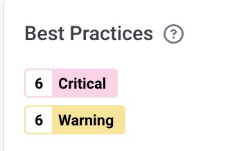
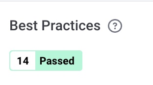
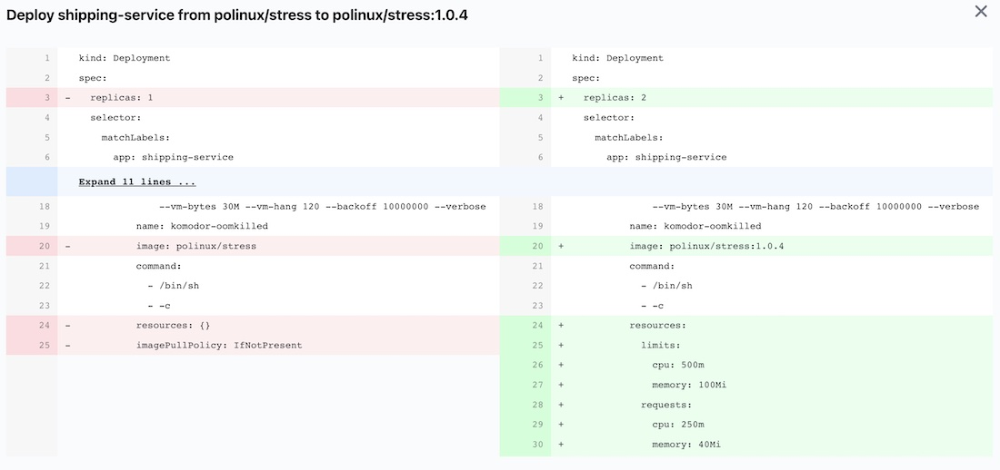

# Service Improvement Best Practices 

## Simple Service 
Simple project for demonstrating Komodor [Best Practices](https://docs.komodor.com/Learn/Static-Prevention.html#how-it-works) 
Deploy.  See the Changes that demonstrate the different between a Kubernetes Deployment and Significantly Improved Kubernetes Deployment

Run the Shipping Service deployment manifest
Review the Best Practices Score

```% kubectl create ns improve-service```

```% kubectl apply -f  https://raw.githubusercontent.com/hughbrien/optimization_testing/main/improve-service/shipping.yaml -n improve-service```   

- Check the [Click the URL of Service](https://app.komodor.com/main/events?sortBy=%7B%22key%22%3A%22endtime%22%2C%22direction%22%3A-1%7D&filters=%7B%7D&timeWindow=168)
and select Info Tab


- Review the Best Practices 



## Upgrade Service

Run the "fixed" Shipping Service deployment manifest
Review the Results 

```% kubectl apply -f  https://raw.githubusercontent.com/hughbrien/optimization_testing/main/improve-service/shipping-fixed.yaml -n improve-service ``` 

- Do the same as above and Note the Results 
- Check the [Click the URL of Service](https://app.komodor.com/main/events?sortBy=%7B%22key%22%3A%22endtime%22%2C%22direction%22%3A-1%7D&filters=%7B%7D&timeWindow=168)
and select Info Tab 
- Review the Best Practices 






